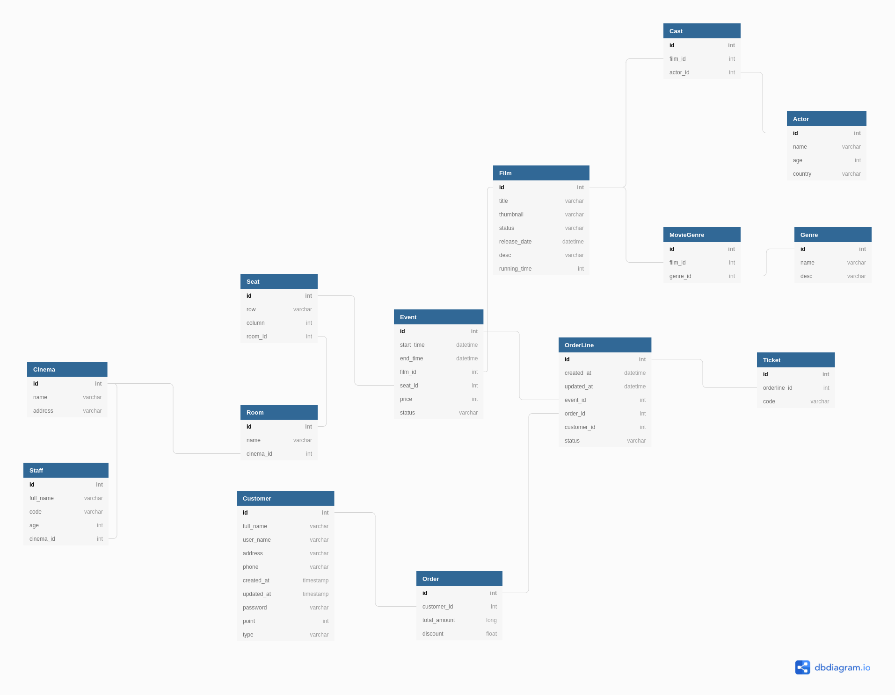

### Database diagram
https://dbdiagram.io/d/607119ceecb54e10c33f9829

### Flow
1. Create OrderLine.
2. Create Order (a list of OrderLine): 
    a. If EventSeat of OrderLine is available(status AVAILABLE),
   then create new Order(status CREATED) and update EventSeat status to IN_PROCESS.
    b. If EventSeat of OrderLine is processing(status IN_PROCESS) or reserved(status RESERVED),
   can not create Order.
     * There is a cron job that automatically gets all CREATED Order and checks if it proceeds quota then sets Order 
   status to TIMEOUT and sets status of all EventSeat back to AVAILABLE.
3. Create payment:
    a. If payment failed, then update Order status to FAILURE and EventSeat status back to AVAILABLE.
    b. If payment succeeds, then update Order status to SUCCESS and EventSeat status to RESERVED.
